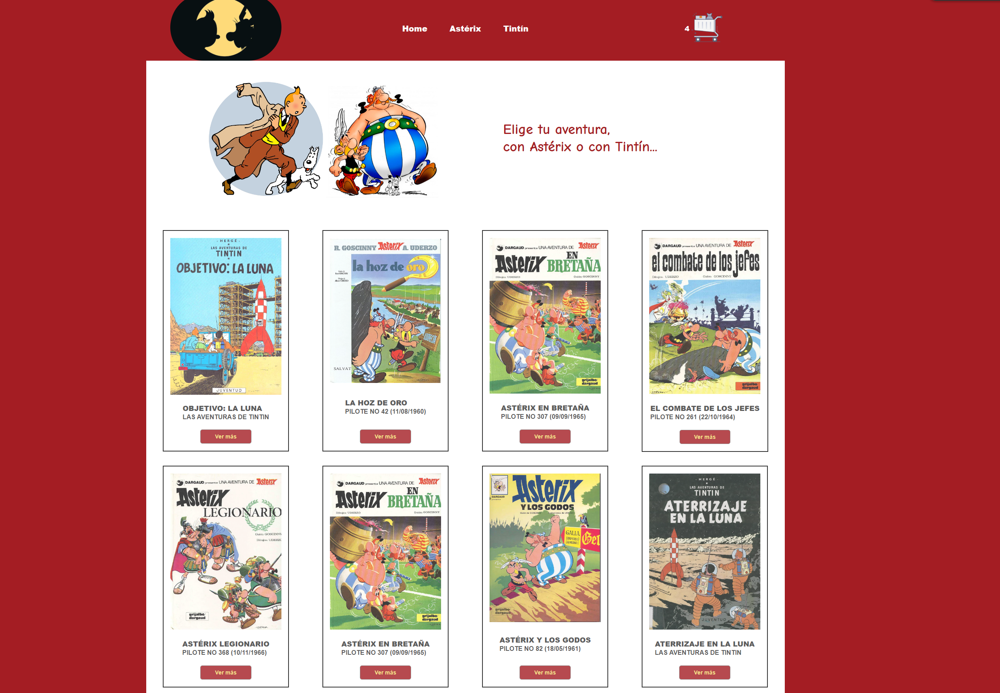
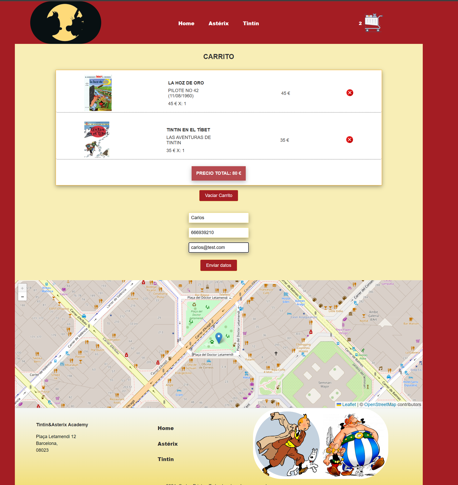
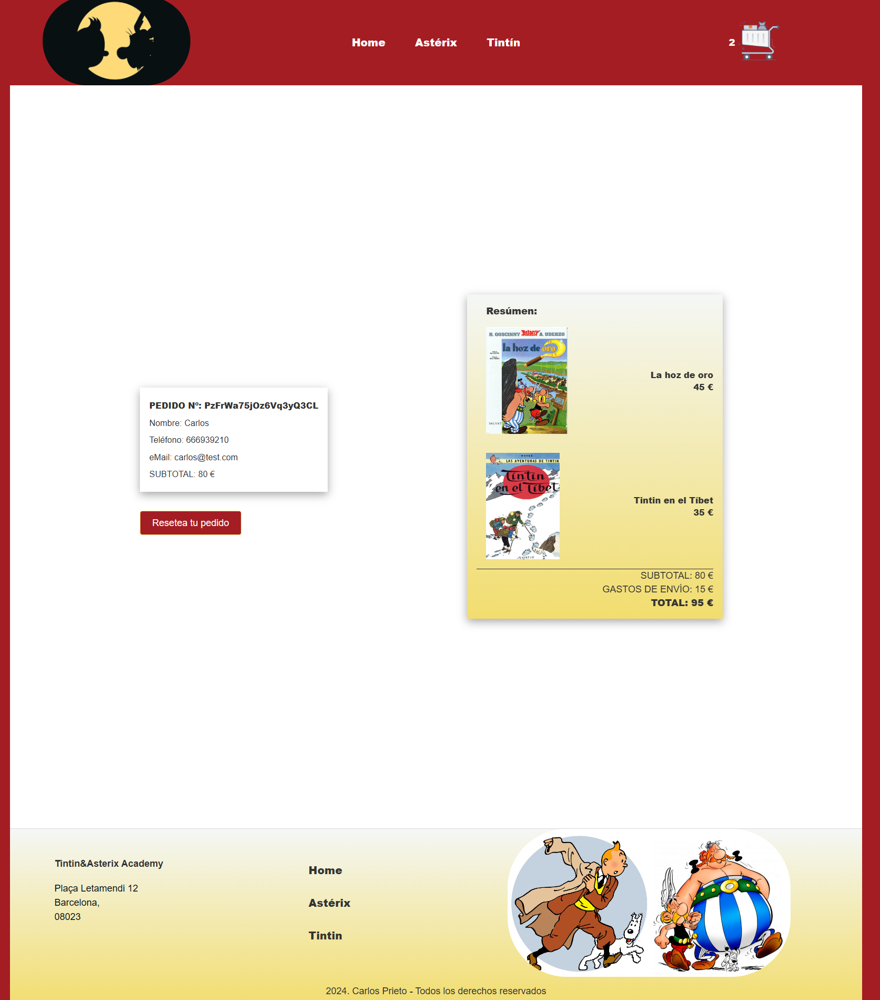

# Ecommerce-React


## Introducción

#### Desarrollar el front end de una tienda online con carrito de compras, utilizando los componentes de React y Firebase como servidor en la nube.
#### Se crea una experiencia de usuario amigable con actualizaciones visuales instantáneas y código escalable.

## Descripción del proyecto

React-Ecommerce es una aplicación web creada con React que emula las funcionalidades básicas de una tienda virtual de comics. Permite a los usuarios buscar dentro de un catálogo de una colección de comics de Asterix y de Tintín y realizar el proceso de compra. La base de datos de Firebase te devolverá un id del pedido con todos los datos.
Este proyecto tiene como objetivo practicar y demostrar habilidades en React, la integración y el manejo de la base de datos de Firebase así como el manejo del diseño de interfaces de usuario.

## Características

- Mostrar un catálogo de una tienda de cómics virtual.
- Navegación por la web filtrando productos por categorías, creando rutas con React Router.
- Creación estado global con React Context para hacer CRUD del carrito.
- Uso de la base de datos de Firebase para almacenar toda la información de los productos y de los pedidos.
- Filtrar para encontrar las aventuras de tus personajes favoritos, ya sea Astérix o Tintín.   
- Se pueden ver los detalles de cada producto, su precio y la cantidad de items restantes.
- Se pueden llevar a un carrito de la compra, introducir tus datos personales y realizar el proceso de compra.
- El sistema te devuelve un ID de pedido. 
- Diseño responsive para dispositivos móviles y de escritorio.



## Tecnologías Utilizadas

- **React**: Biblioteca de JavaScript para construir interfaces de usuario.
- **React Router**: Para la navegación entre diferentes páginas de la aplicación.
- **React Context**: Para pasar datos a través del árbol de componentes sin tener que pasar props manualmente en cada nivel. Crear métodos para que se puedan utilizar en todos los componentes de forma global en la aplicación.
- **Firebase**: configuración y conexión con BBDD cloud Firestore. Configuración de una colección que contendrá los artículos del carrito de la compra así como la creación de un nuevo pedido.
            ```
            { buyer: { name, phone, email },
            items: [{id, title, price}], date, total }
            ```
- **SASS en React,** **Grid, Flexbox,** **CSS3** y **HTML5**: Para el diseño y estructura de la aplicación.
- **React Leaflet**: Uso de esta biblioteca para publicar un mapa de la ubicación de la "oficina de la tienda virtual".
- **BEM**: metodología de nomenclatura y estructura de código CSS. Ayuda a reutilizar estilos, facilita el mantenimiento y hace que los estilos sean más escalables en proyectos web.  
- **React Helmet Async**: Para implementar SEO y Opengraph.

## Estructura de archivos
```
ecommerce-react/
├── public/
│   ├── index.html
│   └── ...
├── src/
│   ├── app/
│   │   ├── api.js
│   │   ├── firebase.js
│   │   ├── routes.js
│   │   ├── Layout.js
│   ├── └── providers/
│   │       └── userProvider.js
│   ├── components/
│   │   ├── ItemDetail.js
│   │   ├── ItemDetailContainer.js
│   │   ├── Item.js
│   │   └── ...
│   ├── pages/
│   │   ├── Home.js
│   │   ├── product.js
│   │   └── ...
│   ├── App.js
│   ├── index.js
│   ├── services/
│   │   └── getProducts.js
│   ├── scss/
│   │   ├── _variables.scss
│   │   ├── _mixins.scss
│   │   ├── ...
│   │   ├── main.scss
│   │   └── ...
│   └── ...
├── .env
├── package.json
└── README.md
```


## Uso 

- Navegación por la web filtrando productos por categorías.
- Página de detalles de producto con información personalizada.
- Añadir productos a un carrito de la compra.
- Introducir datos personales.
- Revisión de la compra y recepción de un número de pedido de la transacción. 

`

